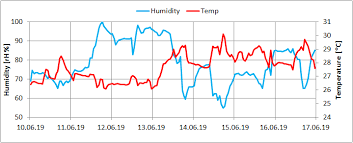

# Python-based Sensor Logger with Real-Time Plotting
- This project simulates a temperature and humidity sensor using Python.
- It logs the simulated sensor data and plots it in real-time using `matplotlib`.  
- This project is ideal for beginners who are learning embedded systems, data logging,     and visualization using Python.

# Features
- Simulated sensor data (temperature and humidity).
- Real-time plotting using `matplotlib`.
- Logging of sensor data with timestamps to a CSV file (`sensor_data.csv`).
- Logging of the real-time session in a log file (`logger.log`).

# Requirements
- Python 3.x
- `matplotlib` (for plotting graphs)
- `random` and `time` libraries (for simulating sensor data)
- `logging` library (for logging data)

# To install `matplotlib`, run:
```bash
pip install matplotlib

